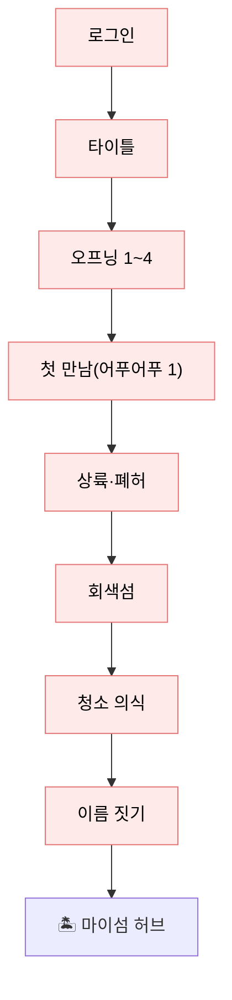
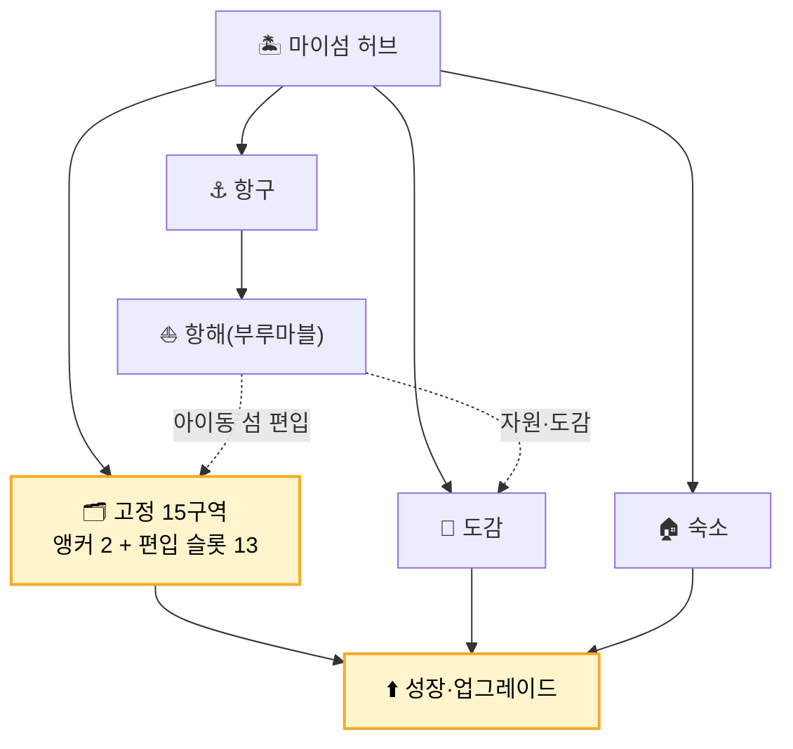
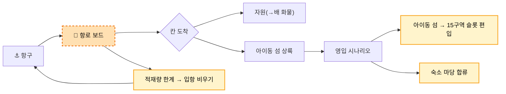
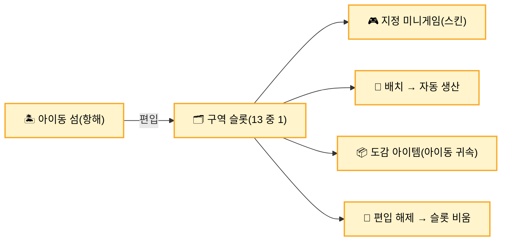

> ⚠️ **이 문서는 구버전입니다.** 2026-06-11 최종확정본은 `사이트맵_260611_최종확정.md`를 보세요.

# 🗺️ 아이동월드 사이트맵

> **구성**: A. 화면 인벤토리(표=본체) · B. 계층 트리 · C. 유저 흐름(Mermaid 보조) · D. 편집 가이드
> **상태 범례**: 🟢 구현(PoC v3) · ✅ 확정 · 🟡 기획중 · 🟠 미결

---

## A. 화면 인벤토리 (사이트맵 본체 · 보강 = 행 추가)

> 화면 1개 = 행 1개. 정렬·필터·그룹 자유. 라우트는 React+Pixi 웹 기준(잠정).

### L0 앱유저 영역
| 계층 | ID | 화면 | 라우트 | 목적 | 다음 | 상태 |
|---|---|---|---|---|---|---|
| L0 | SPLASH-00 | 스플래시/계정 진입 | `/` | 로고·버전·로그인 분기 | LOGIN·PLAYER-00 | ✅ |
| L0 | LOGIN | 로그인 | `/login` | 게스트·소셜 인증 | PLAYER-00 | 🟢 |
| L0 | SIGNUP | 회원가입 | `/signup` | 신규 계정 생성 | TERMS | 🟡 |
| L0 | TERMS | 약관 동의 | `/terms` | 법적 동의 | PLAYER-00 | 🟡 |
| L0 | APP-SET | 앱 설정 | `/settings` | 사운드·알림·계정 | 이전 | 🟡 |
| L0 | USER-INFO | 유저 정보 | `/user` | 프로필·연동·탈퇴 | 이전 | 🟡 |

### L1 플레이어 영역
| 계층 | ID | 화면 | 라우트 | 목적 | 다음 | 상태 |
|---|---|---|---|---|---|---|
| L1 | PLAYER-00 | 타이틀 | `/title` | 입장·최초실행 분기 | OP-01 / HUB | 🟢 |
| L1 | PLAYER-01 | 입장 확인 | `(모달)` | 저장데이터·최초실행 확인 | OP-01 / HUB | 🟡 |

### L2 오프닝 (플레이어캐릭터 진입)
| 계층 | ID | 화면 | 라우트 | 목적 | 다음 | 상태 |
|---|---|---|---|---|---|---|
| L2 | OP-01 | 현실 방 | `/opening` | 새벽·방·다이브 | OP-02 | 🟢 |
| L2 | OP-02 | 바다·조각배 | `/opening` | 윤슬·회색섬·선택 분기 | OP-03 | 🟢 |
| L2 | OP-03 | 어푸어푸 구조 | `/first-meeting` | 첫 아이동 영입(가챠 1) | OP-04 | 🟢 |
| L2 | OP-04 | 소개·상륙 | `/opening/part2` | 아이동 섬 안내·상륙 | LAND-01 | 🟢 |

### L3 마이섬 상륙 (온보딩)
| 계층 | ID | 화면 | 라우트 | 목적 | 다음 | 상태 |
|---|---|---|---|---|---|---|
| L3 | LAND-01 | 첫 상륙 지도 | `/heart-island/first` | 15구역 첫 노출(회색) | LAND-02 | 🟢 |
| L3 | LAND-02 | 숙소 재건 전 | `(씬)` | 폐허·청소 퀘스트 | LAND-03 | 🟢 |
| L3 | LAND-03 | 15구역 둘러보기 | `/island/full-map?tour` | 구역 클릭 퀘스트 | LAND-04 | 🟢 |
| L3 | LAND-04 | 이름 짓기 | `/heart-island/naming` | 숙소명·섬명 저장 | HUB | 🟢 |

### 마이섬 허브 (본 게임)
| 계층 | ID | 화면 | 라우트 | 목적 | 다음 | 상태 |
|---|---|---|---|---|---|---|
| HUB | ISLAND-HUB | 마이섬 허브 | `/island` | 본 게임 허브 | 전 모듈 | 🟢 |
| HUB | FULL-MAP | 풀맵 | `/island/full-map` | 15구역 전체·현위치 | 허브 | 🟢 |

### 숙소 SOOKSO
| 계층 | ID | 화면 | 라우트 | 목적 | 다음 | 상태 |
|---|---|---|---|---|---|---|
| 숙소 | LODGE | 숙소 메인 | `/island/lodge` | 거주·전체 아이동 컨트롤 | 방/마당/꾸미기/연습 | ✅ |
| 숙소 | LODGE-ROOM | 방(육성 슬롯) | `/island/lodge/room` | 육성 제한·증축 | — | ✅ |
| 숙소 | LODGE-YARD | 마당(인벤토리) | `/island/lodge/yard` | 보유 아이동·배치 출발 | 구역 배치 | ✅ |
| 숙소 | LODGE-DECO | 꾸미기·옷·방 | `/island/lodge/deco` | 마이룸·의상 | — | 🟡 |
| 숙소 | TRAIN | 연습실 | `/island/lodge/train` | 보컬·댄스 훈련 | UPGRADE | 🟡 |

### 항구·항해
| 계층 | ID | 화면 | 라우트 | 목적 | 다음 | 상태 |
|---|---|---|---|---|---|---|
| 항해 | HARBOR | 항구 | `/island/harbor` | 항해 출입구·매매 | BOARD | ✅ |
| 항해 | ROUTE | 항로 선택 | `/voyage/route` | 산책·나와바리·신규 | BOARD | 🟡 |
| 항해 | BOARD | 항로 보드 | `/voyage/board` | 지정 이동 기본 + 주사위 옵션 | TILE | ✅ |
| 항해 | TILE | 칸 도착 | `(보드 내)` | 자원·이벤트·아이동 섬 | ISLE | 🟡 |
| 항해 | ISLE | 아이동 섬 상륙 | `/voyage/island/:id` | 영입 시나리오 | RECRUIT | 🟡 |
| 항해 | RECRUIT | 영입 시나리오 | `/voyage/island/:id/landing` | 1컷·합류·**슬롯 편입** | 숙소·ZONE | 🟡 |

### 구역 (고정 15 = 앵커 2 + 편입 슬롯 13)
| 계층 | ID | 화면 | 라우트 | 목적 | 다음 | 상태 |
|---|---|---|---|---|---|---|
| 구역 | ZONE | 구역 슬롯(13) | `/island/zone/:id` | 편입된 아이동 콘텐츠 | 미니게임/배치 | ✅ |
| 구역 | ZONE-MG | 지정 미니게임 | `/island/zone/:id/game` | 스킨형 미니게임 | 도감 아이템 | 🟡 |
| 구역 | ZONE-PROD | 배치·생산 | `(구역 내)` | 아이동 배치 자동 생산 | — | ✅ |

### 성장·수집
| 계층 | ID | 화면 | 라우트 | 목적 | 다음 | 상태 |
|---|---|---|---|---|---|---|
| 성장 | DEBUT | 데뷔 스테이지 | `/debut/:id` | 무대 점수·등급·SUNO AI | 보상 | 🟡 |
| 성장 | CODEX | 도감 | `/codex` | 7종 도감·25 귀속 아이템 | UPGRADE | ✅ |
| 성장 | UPGRADE | 업그레이드 | `(캐릭터)` | 진화(댄스/랩머신 등) | — | ✅ |
| 성장 | CHAR | 캐릭터 정보 | `/character/:id` | 파라미터·스탯 상세 | — | 🟡 |

### 케어·AI
| 계층 | ID | 화면 | 라우트 | 목적 | 다음 | 상태 |
|---|---|---|---|---|---|---|
| 케어 | CARE | 케어(식사·재우기) | `(허브 모달)` | 5대 액티비티 | — | ✅ |
| AI | TALK | 페르소나 대화 | `/talk/:id` | 말풍선·선택지 대화 | — | ✅ |
| AI | DREAM | 꿈 일기 | `/diary/:id` | 재우기→꿈 에피소드 | — | ✅ |
| 케어 | LETTER | 편지 | `/letter/:id` | 작성·AI 답장 | — | 🟡 |

### 표현·꾸미기
| 계층 | ID | 화면 | 라우트 | 목적 | 다음 | 상태 |
|---|---|---|---|---|---|---|
| 표현 | MYROOM | 마이룸 꾸미기 | `/myroom` | 가구·분위기·공간 확장 | — | 🟡 |
| 표현 | CLOSET | 의상 | `/closet/:id` | 코디·성장 연동 | — | 🟡 |
| 표현 | BINDER | 포토카드 My Binder | `/binder` | 카드 보관·전시 | SNS/장터 | ✅ |

### 소셜·팬덤·UGC
| 계층 | ID | 화면 | 라우트 | 목적 | 다음 | 상태 |
|---|---|---|---|---|---|---|
| 소셜 | VVIEW | Visual View | `/visualview` | 키워드 그래프·하트 투표 | — | 🟡 |
| 소셜 | UGC-MAKE | 크리에이터 공방 | `/ugc/create` | 의상·가구 제작 | 장터 | 🟡 |
| 소셜 | UGC-SHOP | UGC 장터 | `/ugc/market` | 코인 거래 | — | 🟡 |
| 소셜 | FRIEND | 친구·마이룸 방문 | `/friends` | 친구·방문·선물 | — | 🟡 |
| 소셜 | EVENT | 이벤트·시즌 | `/event` | 정기·시즌·Fandom Battle | — | 🟡 |

### 상점·시스템·개발
| 계층 | ID | 화면 | 라우트 | 목적 | 다음 | 상태 |
|---|---|---|---|---|---|---|
| 경제 | SHOP | 상점 | `/shop` | 6탭·일일 특가 | — | 🟡 |
| 경제 | STAR-SHOP | 별빛 상점(결제) | `/shop/star` | IAP·프리미엄 | — | 🟡 |
| 시스템 | SYS | 설정/계정/통계/CS | `/system` | 알림·보안·기록·CS | — | 🟡 |
| 개발 | DEV | 에셋 카탈로그 | `/dev/catalog` | 디버그·QA | — | 🟢 |

---

## B. 계층 트리 (내비게이션 한눈에)

```text
앱유저(L0) ─ 스플래시 · 로그인 · 회원가입 · 약관 · 설정 · 유저정보
플레이어(L1) ─ 타이틀 · 입장확인
오프닝(L2) ─ 현실방 → 바다·조각배 → 어푸어푸 구조 → 소개·상륙
마이섬 상륙(L3) ─ 첫상륙지도 → 숙소재건전 → 15구역 둘러보기 → 이름짓기
│
└─ 마이섬 허브 /island  ★본게임
   ├─ 풀맵 /island/full-map
   ├─ 숙소 SOOKSO /island/lodge
   │   ├─ 방(육성) · 마당(인벤토리) · 꾸미기 · 연습실
   ├─ 항구 /island/harbor
   │   └─ 항로 보드 /voyage/board → 칸 도착 → 아이동 섬 → 영입 → 슬롯 편입
   ├─ 구역 슬롯 ×13 /island/zone/:id
   │   └─ 지정 미니게임 · 배치 생산 · 도감 아이템
   ├─ 도감 /codex → 업그레이드
   ├─ 데뷔 스테이지 /debut/:id
   ├─ 케어/AI ─ 대화 · 꿈일기 · 편지
   ├─ 표현 ─ 마이룸 · 의상 · 포토카드(My Binder)
   ├─ 소셜 ─ Visual View · UGC 공방/장터 · 친구 · 이벤트
   └─ 상점 · 시스템 · (개발도구)
```

---

## C. 유저 흐름 (Mermaid · 보조)

> 인벤토리(A)가 "무엇이 있나", 흐름(C)이 "어떻게 이동하나". 발표·동선 검토용 보조.

### C-1. 온보딩 (1회성 · 단방향)


### C-2. 본 게임 루프 (허브 중심)


### C-3. 항해 → 편입

> ✅ 이동 = **지정 이동 기본 + 주사위 옵션**(6/9 확정). 편입 절차 → [아이동편입_아이동섬편입_절차초안_260608.md]. (결정 전문 → [09_미결정사항_결정로그.md])

### C-4. 구역 슬롯 (반복 패턴)


---

## D. 편집 가이드

- **본체는 A(표)**. 화면이 생기면 **해당 계층 표에 행 1줄** 추가하면 끝. (정렬/필터가 필요하면 CSV·Notion으로 그대로 이관 — 컬럼 동일)
- **상태 컬럼**으로 진척 관리: 🟢구현 / ✅확정 / 🟡기획중 / 🟠미결.
- **흐름(C)** 은 동선이 바뀔 때만 손봄. "사이트맵 갱신해줘" 한마디로 A↔C 동기화.
- **다음**: 화면별 `진입조건·필요데이터·모듈` 컬럼을 더 붙이면 그대로 개발 티켓 명세가 됨. UI 디자인 단계에선 각 행 → FigJam 프레임 1개로 매핑.

---

## E. 모듈 맵 (모듈별 묶음 뷰)

> A(인벤토리)를 **기능 모듈**로 재그룹. 모듈 = 화면 묶음 + 내부 규칙. **모듈 단위로 기획·개발·검수**.

### 모듈 목록 (M01~M20)
| 모듈 | 이름 | 핵심 화면 | GDD 시스템 |
|---|---|---|---|
| M01 | 로그인(Auth) | 스플래시·로그인·약관·로그아웃 | 진입 |
| M02 | 오프닝(온보딩) | OP-01~04 · LAND-01~04 | 진입 |
| M03 | 마이섬 허브 | HUB · 풀맵 | §2 |
| M04 | 숙소(SOOKSO) | 방·마당·꾸미기·연습실 | §17·5 |
| M05 | 항해(Voyage) | 항구·보드·아이동섬·영입 | §8 |
| M06 | 구역·편입(Zone) | 구역 슬롯 13·미니게임·배치 | §8·신규 |
| M07 | 케어(다마고치) | 식사·재우기·그루밍 | §5·6 |
| M08 | 성장·데뷔 | 숙련도·진화·데뷔 스테이지 | §7·13·14 |
| M09 | 도감·수집 | 7종 도감·업그레이드 | §10 |
| M10 | AI 페르소나·꿈일기 | 대화·꿈일기·편지 | §15 |
| M11 | 포토카드 | My Binder·SNS·장터 | §11 |
| M12 | 마이룸·꾸미기 | 가구·확장·방문 | §17 |
| M13 | 의상·패션 | 코디·패션 챌린지 | §18 |
| M14 | UGC 공방·장터 | 제작·등록·거래 | §19 |
| M15 | Visual View·Fandom Battle | 키워드 그래프·하트 투표 | §16 |
| M16 | 소셜·친구 | 친구·방문·선물·초대코드 | §22 |
| M17 | 상점·경제(결제) | 6탭·별빛상점·IAP | §4·20 |
| M18 | 이벤트·시즌 | 정기·시즌·명예의 전당 | §21 |
| M19 | 설정·계정·시스템 | 설정·연동·전환·탈퇴·통계·CS | §23 |
| M20 | 알림·리텐션 | 9 알림·리텐션 훅 | §23 |

> ▶ 아래는 M01만 상세. 나머지 모듈도 같은 양식으로 채워 나간다.

---

### ▶ M01. 로그인 모듈 (Auth / 계정 진입)

**목적**: 게임 진입 전 인증·동의. **소셜 로그인 전용**(ID/비밀번호 없음).

**화면 구성**
| ID | 화면 | 내용 | 상태 |
|---|---|---|---|
| AUTH-SPLASH | 스플래시 | 로고·버전 체크·**자동 로그인** 토큰 확인 | ✅ |
| AUTH-LOGIN | 로그인 | 소셜 버튼 N종 + 자동 로그인 토글 | 🟢 |
| AUTH-TERMS | 약관 동의 | 필수(이용약관·개인정보) + **연령 정보 체크** + 선택(마케팅) | 🟡 |
| AUTH-TOS | 이용약관 전문 | 약관 본문 페이지 | 🟡 |
| AUTH-PRIVACY | 개인정보 처리방침 전문 | 본문 페이지 | 🟡 |
| AUTH-LOGOUT | 로그아웃 | 진입 전 안전 이탈·계정 전환 | 🟡 |

**소셜 로그인 목록**
| 제공자 | 상태 | 비고 |
|---|---|---|
| 구글 (= 유튜브) | ✅ 확정 | 유튜브 로그인 = 구글 OAuth, 동일 |
| 애플 | ✅ 확정 | iOS·Safari 사용자 |
| 트위터(X) | ✅ 확정 | **K-POP 팬덤 1순위 플랫폼** |
| 카카오 | 🟡 포함(고려중) | 국내 |
| 네이버 | 🟡 포함(고려중) | 국내 |
| 게스트(즉시 시작) | → M02 오프닝 | 로그인 없이 튜토리얼 시작, 로그인·바인딩은 이후(튜토리얼과 함께 설계) |
| LINE | ✅ 확정 | JP·TW·TH·ID 팬덤(글로벌 핵심) |
| Discord | ⚪ 선택 | 글로벌 팬 커뮤니티 |
| Facebook | ⚪ 선택 | 글로벌 폴백 |
| 이메일/비밀번호 | ❌ 제외 | 소셜 전용 → 미사용 |

**규칙·결정**
- ❌ **비밀번호·아이디 찾기 없음** — 소셜 전용이라 불필요 (확정)
- **로그아웃**은 로그인 모듈에 둠 — 게임 진입 전에도 안전 이탈 가능
- **자동 로그인** = 토큰 유지(스플래시에서 확인)
- 계정 **연동·전환·탈퇴** → **M19 설정 모듈**로 이관 (로그인 모듈 = 로그인 + 자동로그인 + 약관)
- **연령 정보 체크 = 약관 단계에 포함**(확정). 상세 age-gate(만 14세 미만 법정대리인 동의·COPPA·GDPR)는 추후 검토
