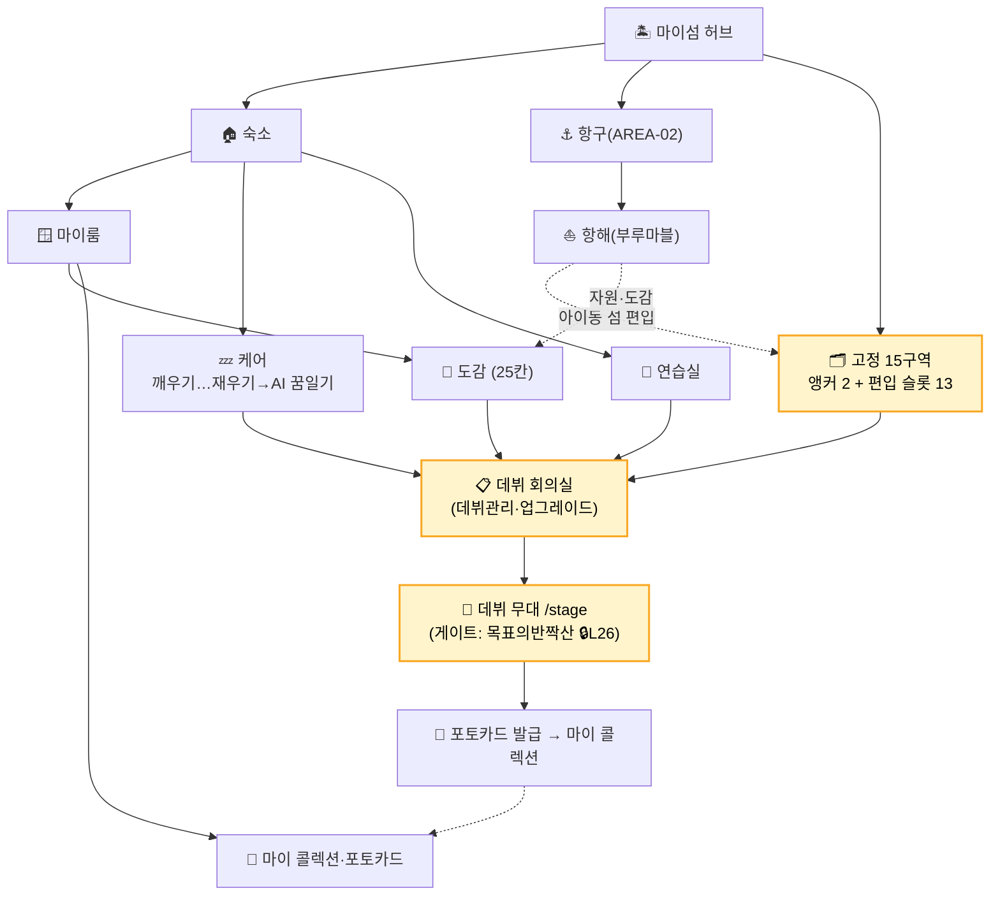

# 🗺️ 아이동월드 사이트맵 (최종확정 260611)

> **구성**: A. 화면 인벤토리(표=본체) · B. 계층 트리 · C. 유저 흐름(Mermaid 보조)
> **상태 값**: 구현 · 확정 · 기획중 · 미결 · 보류

---

## A. 화면 인벤토리 (사이트맵 본체 · 보강 = 행 추가)

### 앱유저 (상시 셸)

| 구분 | ID | 화면 | 라우트 | 다음 | 내용/목적 | 상태 | 비고 | 모듈 | 모듈주요기능 |
|---|---|---|---|---|---|---|---|---|---|
| 앱유저 | SPLASH-00 | 스플래시/계정 진입 | `/` | LOGIN | 로고·버전·로그인 분기 | 확정 | 유저레이어·①셸 | M01 | |
| 앱유저 | LOGIN | 로그인 | `/login` | TITLE | 게스트·소셜 인증 | 확정 | 유저레이어·①셸 | M01 | |
| 앱유저 | SIGNUP | 회원가입 | `/signup` | TERMS | 신규 계정 생성 | 확정 | 유저레이어·①셸 | M01 | |
| 앱유저 | TERMS | 약관 동의 | `/terms` | TITLE | 법적 동의 | 확정 | 유저레이어·①셸 | M01 | |
| 앱유저 | APP-SET | 앱 설정 | `/settings` | 이전 | 사운드·알림·계정 | 기획중 | 상시 셸 | M19 | |
| 앱유저 | USER-INFO | 유저 정보 | `/user` | 이전 | 프로필·연동·탈퇴 | 기획중 | 상시 셸 | M19 | |
| 앱유저 | ALERT-CENTER | 알림센터 | `/alerts` | — | 푸시·리텐션 알림 모음 | 미결 | 상시 셸·오버레이 | M20 | 재방문 유도 ★신규 |

### 플레이어 (L1 · 상시 셸)

| 구분 | ID | 화면 | 라우트 | 다음 | 내용/목적 | 상태 | 비고 | 모듈 | 모듈주요기능 |
|---|---|---|---|---|---|---|---|---|---|
| 플레이어 | SHOP | 상점 | `/shop` | 이전 | 별빛·재화 판매 (L21: 다이아 표기 폐기) | 미결 | 상시 셸(구 L5) | M17 | |
| 플레이어 | ADWALL | 광고벽 | `/adwall` | 이전 | 리워드 광고(BM) | 보류 | 상시 셸(구 L6) | M17·M20 | |
| 플레이어 | TITLE | 타이틀 | `/title` | OP-01·HUB | 입장·최초실행 분기 | 확정 | 유저→캐릭터 경계 | M01 | 최초진입 확인·오프닝 체크는 모듈 기능 |
| 플레이어 | ATTEND | 출석부 | `/attendance` | 이전 | 일일 출석 보상 | 기획중 | 데일리·상시 셸 | M20 | 일일 마이크로 딜라이트(PoC v17) ★신규 |
| 플레이어 | ROULETTE | 오늘의색 룰렛 | `/roulette` | 이전 | 일일 룰렛·행운색 | 기획중 | 데일리·상시 셸 | M20 | 일일 마이크로 딜라이트(PoC v17) ★신규 |
| 플레이어 | SOCIAL | 소셜·친구 | `/social` | 친구섬·방명록 | 친구 목록·방문·자재교환·일기회독 | 보류 | 상시 셸 · Phase3 자리확보 | M16 | 비동기 소셜·친구섬·방명록 |
| 플레이어 | FANDOM | 팬덤(비주얼뷰) | `/fandom` | 배틀·랭킹 | 비주얼뷰·팬덤배틀·랭킹 | 보류 | 상시 셸 · Phase 후속 자리확보 | M15 | 비주얼뷰·팬덤배틀 |
| 플레이어 | UGC | UGC 공방·장터 | `/ugc` | 공방·장터 | 아이템 제작·거래·장터 | 보류 | 상시 셸 · Phase2 자리확보 | M14 | UGC 제작·거래·장터 |
| 플레이어 | EVENT-MAIN | 이벤트 허브 | `/event` | — | 진행 이벤트·시즌 목록 | 미결 | 상시·④기능 | M18 | 이벤트 팝업 진입 ★신규 |
| 플레이어 | EVENT-SEASON | 시즌(보류) | `/event/season` | — | 시즌 콘텐츠 | 보류 | Phase2 | M18 | 시즌패스 보류(BM) ★신규 |
| 플레이어 | PLAYER-NAV | 상단바/네비게이터 | (전역 오버레이) | 캐릭터·설정·상점·별빛 | 로그인 후 상시 노출 내비 — 캐릭터·설정·별빛·재화·상점 진입 | 기획중 | 화면 아님·전역 오버레이(HUD) · 로그인 후 상시 | M03·M17·M19 | 재화/별빛 표시 · 상점·설정·캐릭터 바로가기 (L21) |

### 오프닝 (L2~L3 · 1회성)

| 구분 | ID | 화면 | 라우트 | 다음 | 내용/목적 | 상태 | 비고 | 모듈 | 모듈주요기능 |
|---|---|---|---|---|---|---|---|---|---|
| 오프닝 | OP-01 | 현실 방 | `/opening` | OP-02 | 새벽·방·다이브 | 기획중 | 오프닝(경계)·스페셜 | M02 | |
| 오프닝 | OP-02 | 바다·조각배 | `/opening` | OP-03 | 윤슬·회색섬·선택 분기 | 기획중 | 오프닝·스페셜 | M02 | |
| 오프닝 | OP-03 | 어푸어푸 구조 | `/first-meeting` | OP-04 | 첫 아이동 영입(고정 개체·시드 발급) — L22: 가챠 표현 폐기 | 확정 | 오프닝·스페셜 | M02 | |
| 오프닝 | OP-04 | 소개·상륙 | `/opening/part2` | LAND-01 | 아이동 섬 안내·상륙 | 기획중 | 오프닝·스페셜 | M02 | |
| 오프닝 | LAND-01 | 첫 상륙 지도 | `/heart-island/first` | LAND-02 | 15구역 첫 노출(회색) | 기획중 | 오프닝·스페셜 | M02 | |
| 오프닝 | LAND-02 | 숙소 재건 전 | (씬) | LAND-03 | 폐허·청소 퀘스트 | 기획중 | 오프닝·스페셜 | M02 | |
| 오프닝 | LAND-03 | 15구역 둘러보기 | `/island/full-map?tour` | LAND-04 | 구역 클릭 퀘스트 | 기획중 | 오프닝·스페셜 | M02 | |
| 오프닝 | LAND-04 | 이름 짓기 | `/heart-island/naming` | HUB | 숙소명·섬명 저장·시드 | 확정 | 오프닝 종료→온보딩 | M02 | |

### 마이섬 HUB

| 구분 | ID | 화면 | 라우트 | 다음 | 내용/목적 | 상태 | 비고 | 모듈 | 모듈주요기능 |
|---|---|---|---|---|---|---|---|---|---|
| 마이섬HUB | ISLAND-HUB | 마이섬 허브 | `/island` | 전 모듈·액티비티 | 본 게임 허브·메인 액티비티 버튼 | 구현 | 캐릭터·②장소 | M03 | |
| 마이섬HUB | FULL-MAP | 풀맵 | `/island/full-map` | 각 구역 | 15구역 전체·현위치·구역 진입 | 구현 | 캐릭터·②장소 | M03 | |

### 마이섬 15구역 (앵커 2 + 편입/활동 13)

| 구분 | ID | 화면 | 라우트 | 다음 | 내용/목적 | 상태 | 비고 | 모듈 | 모듈주요기능 |
|---|---|---|---|---|---|---|---|---|---|
| 마이섬-구역 | AREA-01 | 꿈꾸는 등대 | `/island/area/01` | 구역 활동 | 정서:희망·길잡이 / 활동:온보딩 힌트·길잡이 (L26: 무대 아님) | 미결 | 캐릭터·②장소 | (배치예정) | |
| 마이섬-구역 | AREA-02 | 감정의 파도 항구 | `/island/area/02` | BOARD | 정서:출항·떠남 / 항구·매매 | 확정 | 앵커🔒 | M05 | |
| 마이섬-구역 | AREA-03 | 기억의 숲 | `/island/area/03` | 구역 활동 | 정서:추억·흔적 / 활동:신경쇠약·일기회독 | 기획중 | 캐릭터·②장소 | 미니게임(PoC 기억의 숲) | |
| 마이섬-구역 | AREA-04 | 고민 해결 동굴 | `/island/area/04` | 구역 활동 | 정서:고민·해답 / 활동:대화·우연케어 | 미결 | 캐릭터·②장소 | (배치예정) | |
| 마이섬-구역 | AREA-05 | 자신감 폭포 | `/island/area/05` | 구역 활동 | 정서:자존감·재기 / 활동:광산·시그니처 발화 | 기획중 | 캐릭터·②장소 | 미니게임(PoC 야명주 광산) | |
| 마이섬-구역 | AREA-06 | 휴식의 오아시스 | `/island/area/06` | 구역 활동 | 정서:쉼·평온 / 활동:방치형·재우기 | 미결 | 캐릭터·②장소 | 미니게임(후보) | |
| 마이섬-구역 | AREA-07 | 시간의 모래 광장 | `/island/area/07` | 구역 활동 | 정서:시간·순간 / 활동:일기 5조각 노출 | 미결 | 캐릭터·②장소 | (배치예정) | |
| 마이섬-구역 | AREA-08 | 성찰의 등산로 | `/island/area/08` | 구역 활동 | 정서:자기성찰 / 활동:산책·일기 통편 | 미결 | 캐릭터·②장소 | (배치예정) | |
| 마이섬-구역 | AREA-09 | 목표의 반짝 산 | `/island/area/09` | 구역 활동 | 정서:목표·성취 / 활동:데뷔 무대 in-world 게이트 | 확정(게이트) | 캐릭터·②장소 · 데뷔무대 게이트 🔒L26 | M08 연계 | 데뷔는 숙소 데뷔회의실에서 결정→여기서 무대 개최 (L26 확정) |
| 마이섬-구역 | AREA-10 | 우정의 다리 | `/island/area/10` | 구역 활동 | 정서:관계·연결 / 활동:동행·꼬시기 | 미결 | 캐릭터·②장소 | M16(소셜 후보) | |
| 마이섬-구역 | AREA-11 | 창의의 샘 | `/island/area/11` | 구역 활동 | 정서:영감·표현 / 활동:크래프팅·예술능력치 | 미결 | 캐릭터·②장소 | (배치예정) | |
| 마이섬-구역 | AREA-12 | 도전의 절벽 | `/island/area/12` | 구역 활동 | 정서:두려움·용기 / 활동:광산·새 항로 도전 | 미결 | 캐릭터·②장소 | (배치예정) | |
| 마이섬-구역 | AREA-13 | 꿈 조각 하우스 | `/island/area/13` | SOOKSO | 정서:꿈 모음 / 숙소 SOOKSO 자체 | 확정 | 앵커🔒 | M04 | |
| 마이섬-구역 | AREA-14 | 성장의 정원 | `/island/area/14` | 구역 활동 | 정서:천천히 자람 / 활동:정원·재배 | 기획중 | 캐릭터·②장소 | 미니게임(PoC 성장의 정원) | |
| 마이섬-구역 | AREA-15 | 반성의 호수 | `/island/area/15` | 구역 활동 | 정서:자기인식 / 활동:풀샷 모드·도감 회독 | 미결 | 캐릭터·②장소 | (배치예정) | |

### 숙소 (SOOKSO)

| 구분 | ID | 화면 | 라우트 | 다음 | 내용/목적 | 상태 | 비고 | 모듈 | 모듈주요기능 |
|---|---|---|---|---|---|---|---|---|---|
| 숙소 | SOOKSO | 숙소 메인 | `/island/lodge` | 방/마당/꾸미기/연습 | 거주·전체 아이동 컨트롤 | 구현 | 캐릭터·②장소 | M04 | |
| 숙소 | SOOKSO-ROOM | 방(육성 슬롯) | `/island/lodge/room` | — | 육성 제한·증축 | 기획중 | 캐릭터·②장소 | M04 | |
| 숙소 | SOOKSO-YARD | 마당(인벤토리) | `/island/lodge/yard` | 구역 배치 | 보유 아이동·배치 출발 | 기획중 | 캐릭터·②장소 | M04 | |
| 숙소 | SOOKSO-DECO | 꾸미기·옷·방 | `/island/lodge/deco` | — | 마이룸·의상 | 기획중 | 캐릭터·②장소 | M12·M13 | |
| 숙소 | SOOKSO-TRAIN | 연습실 | `/island/lodge/train` | SOOKSO-DEBUT | 보컬·댄스 훈련·데뷔준비 | 기획중 | 캐릭터·②장소 | M08 | 숙련도→데뷔회의실 |
| 숙소 | SOOKSO-DEBUT | 데뷔 회의실 | `/island/lodge/debut` | STAGE-MAIN | 데뷔 관리·세팅·업그레이드 총괄 | 기획중 | 캐릭터·④기능 · 데뷔 결정은 여기서→무대는 목표의반짝산 🔒L26 | M08 | 데뷔관리·업그레이드·세팅 ★신규 |

### 마이룸 (M21 ★신규 모듈)

| 구분 | ID | 화면 | 라우트 | 다음 | 내용/목적 | 상태 | 비고 | 모듈 | 모듈주요기능 |
|---|---|---|---|---|---|---|---|---|---|
| 마이룸 | MYROOM-HOME | 마이룸 홈 | `/island/lodge/myroom` | 정보/아이동/백과 | 마이정보·아이동·인사이클로피디아 연결 | 기획중 | 캐릭터·③엔티티 | M21 | |
| 마이룸 | MYROOM-INFO | 마이 정보 | `/island/lodge/myroom/info` | — | 유저 프로필 | 기획중 | 캐릭터 | M21 | |
| 마이룸 | MYROOM-AIDONG-LIST | 마이 아이동 리스트 | `/island/lodge/myroom/aidong` | 시트 | 멤버/보유 구분·데뷔준비 | 기획중 | 캐릭터·③엔티티 | M21 | |
| 마이룸 | MYROOM-AIDONG-SHEET | 마이 아이동 시트 | `/island/lodge/myroom/aidong/:id` | 확장 | 내 개체 현재상태·파라미터 | 기획중 | 다이내믹 | M21 | |
| 마이룸 | MYROOM-AIDONG-EXT | 마이 아이동 시트 확장 | `/island/lodge/myroom/aidong/:id/ext` | ENCY-AIDONG | 종 원본 시트로 연결 | 기획중 | 다이내믹→스태틱 연결 | M21→4장 | |
| 마이룸 | MYROOM-CODEX | 아이동 도감 | `/island/lodge/myroom/codex` | — | 도감템 수집 진행(25칸·다이내믹) | 기획중 | 캐릭터·④기능·다이내믹 | M09 | 콜렉션(휘장)과 구분·수집상태 ★신규 |
| 마이룸 | MYROOM-COLLECT | 마이 콜렉션 | `/island/lodge/myroom/collection` | PHOTOCARD-GEN | 수집물·휘장·뱃지·포토카드 | 기획중 | 캐릭터·④기능 | M09·M11 | 포토카드 편입 |
| 마이룸 | PHOTOCARD-GEN | 포토카드 생성 | `/island/lodge/myroom/collection/photocard/new` | PHOTOCARD-GALLERY | 데뷔·순간 포토카드 생성 | 기획중 | 캐릭터·④기능 · 콜렉션 하위(진입점 추후 추가) | M11 | 캡처·템플릿 ★신규 |
| 마이룸 | PHOTOCARD-GALLERY | 포토카드 갤러리 | `/island/lodge/myroom/collection/photocard` | — | 보유 카드·공유 | 기획중 | 캐릭터·④기능 · 콜렉션 하위 | M11 | 외부 공유·내보내기 ★신규 |
| 마이룸 | MYROOM-LEDGER | 마이 가계부 | `/island/lodge/myroom/ledger` | — | 별빛 구매·사용 이력 (L21) | 기획중 | 캐릭터·①셸 | M17 | |
| 마이룸 | MYROOM-EXT | (미정) | — | — | 캐릭터 상태 확장 슬롯 | 미결 | 캐릭터 | M21 | |

### 무대·데뷔

| 구분 | ID | 화면 | 라우트 | 다음 | 내용/목적 | 상태 | 비고 | 모듈 | 모듈주요기능 |
|---|---|---|---|---|---|---|---|---|---|
| 무대·데뷔 | STAGE-MAIN | 대표 무대 | `/stage` | DEBUT-SHOW | 데뷔 무대(Phase1 대표 1무대) | 기획중 | 캐릭터·②장소·④기능 · 진입=데뷔회의실, in-world 게이트=목표의반짝산 🔒L26 | M08 | 숙련도 기반·5태스크 연출 ★신규 |
| 무대·데뷔 | DEBUT-SHOW | 데뷔 공연 | `/stage/debut/:id` | PHOTOCARD-GEN | 데뷔 연출·결과 | 기획중 | 캐릭터·④기능 | M08 | 데뷔→포토카드 발급 (진화는 모듈 기능) ★신규 |

### 인사이클로피디아 (백과 · 스태틱)

| 구분 | ID | 화면 | 라우트 | 다음 | 내용/목적 | 상태 | 비고 | 모듈 | 모듈주요기능 |
|---|---|---|---|---|---|---|---|---|---|
| 인사이클로피디아 | ENCY-AIDONG | 아이동 시트(백과) 000-999 | `/encyclopedia/aidong/:id` | — | 종별 스태틱 마스터 열람 | 기획중 | 제공방식 미정·스태틱 | 4장 데이터 | |
| 인사이클로피디아 | ENCY-ISLAND | 아이동 아일랜드(백과) | `/encyclopedia/island` | — | 섬 스태틱 열람 | 미결 | 제공방식 미정 | 4장·M22 | |
| 인사이클로피디아 | ENCY-EXT | (현재 미정) | — | — | 확장 데이터 시트 | 미결 | 제공방식 미정 | 4장 | |

### 항해

| 구분 | ID | 화면 | 라우트 | 다음 | 내용/목적 | 상태 | 비고 | 모듈 | 모듈주요기능 |
|---|---|---|---|---|---|---|---|---|---|
| 항해 | BOARD | 항로 보드 | `/voyage/board` | TILE | 지정 이동 기본+주사위 옵션 | 확정 | 캐릭터·②장소 | M05 | |
| 항해 | TILE1~5 | 칸 도착 | (보드 내) | ISLE | 자원·이벤트·아이동 섬 | 확정 | 타일 5종 | M05 | |
| 항해 | ISLE | 칸 도착_아이동 | `/voyage/island/:id` | iDONGisland_000 | 보드 칸 도착→상륙 | 확정 | 캐릭터·②장소 | M22 | 상륙 전 칸 도착점 |
| 항해 | RECRUIT | 영입 시나리오 | `/voyage/island/:id/landing` | 숙소·구역 | 1컷·합류·슬롯 편입 | 확정 | 캐릭터·④기능 | M06 | |

### 아이동섬 (M22 ★신규 모듈)

| 구분 | ID | 화면 | 라우트 | 다음 | 내용/목적 | 상태 | 비고 | 모듈 | 모듈주요기능 |
|---|---|---|---|---|---|---|---|---|---|
| 아이동섬 | iDONGisland_000 | 아이동섬_메인 | `/voyage/island/:id/land` | 퀘스트·RECRUIT | 상륙 전체화면(마이섬형 확장)·탐험 | 기획중 | 캐릭터·②장소·확장화면 | M22 | ISLE 상륙 후 진입 |
| 아이동섬 | iDONGisland_000_기타 | 아이동섬_서브 | `/voyage/island/:id/sub` | RECRUIT | 섬 퀘스트·영입처리 정리 | 기획중 | 캐릭터·④기능 | M22 | 영입 확정 처리 |

### 액티비티 (케어 · HUB 버튼/팝업)

| 구분 | ID | 화면 | 라우트 | 다음 | 내용/목적 | 상태 | 비고 | 모듈 | 모듈주요기능 |
|---|---|---|---|---|---|---|---|---|---|
| 액티비티 | Activity_Main_01 | 깨우기 | `/activity/main/01` | — | 메인 케어(깨우기) | 기획중 | HUB 메인맵 버튼/팝업 진입 | M07 | 스토리100 배분 |
| 액티비티 | Activity_Main_02 | 아침밥 | `/activity/main/02` | — | 메인 케어(아침) 🔒L24 | 기획중 | HUB 버튼/팝업 | M07 | 스토리100 배분 |
| 액티비티 | Activity_Main_03 | 점심밥 | `/activity/main/03` | — | 메인 케어(점심) 🔒L24 | 기획중 | HUB 버튼/팝업 | M07 | 스토리100 배분 |
| 액티비티 | Activity_Main_04 | 저녁밥 | `/activity/main/04` | — | 메인 케어(저녁) 🔒L24 | 기획중 | HUB 버튼/팝업 | M07 | 스토리100 배분 |
| 액티비티 | Activity_Main_05 | 재우기 (+꿈일기) | `/activity/main/05` | — | 메인 케어(재우기)→AI 꿈일기 생성·기록 | 기획중 | HUB 버튼/팝업 · DREAM-DIARY 편입(M10 백엔드 생성) | M07·M10 | 재우기→꿈일기 생성 · 잠자리 이야기 스토리100 |
| 액티비티 | Activity_Sub_01 | (미정) | `/activity/sub/01` | — | 서브 활동·구역 미니게임 후보 | 미결 | 버튼·팝업 진입 | M07/구역 | |
| 액티비티 | Activity_Sub_02 | (미정) | `/activity/sub/02` | — | 서브 활동 | 미결 | 버튼·팝업 진입 | M07/구역 | |
| 액티비티 | Activity_Sub_03 | (미정) | `/activity/sub/03` | — | 서브 활동 | 미결 | 버튼·팝업 진입 | M07/구역 | |
| 액티비티 | Activity_Sub_04 | (미정) | `/activity/sub/04` | — | 서브 활동 | 미결 | 버튼·팝업 진입 | M07/구역 | |
| 액티비티 | Activity_Sub_05 | (미정) | `/activity/sub/05` | — | 서브 활동 | 미결 | 버튼·팝업 진입 | M07/구역 | |

---

## B. 계층 트리 (내비게이션 한눈에)

```
앱유저(L0·상시 셸) ─ 스플래시 · 로그인 · 회원가입 · 약관 · 설정 · 유저정보
                    · 상점 · 광고벽 · 출석부 · 룰렛
                    · 소셜 · 팬덤(비주얼뷰) · UGC · 이벤트 · 알림  ※소셜~UGC·이벤트는 Phase 자리확보
플레이어(L1) ─ 타이틀 · 입장확인
오프닝(L2) ─ 현실방 → 바다·조각배 → 어푸어푸 구조 → 소개·상륙
마이섬 상륙(L3) ─ 첫상륙지도 → 숙소재건전 → 15구역 둘러보기 → 이름짓기
│
└─ 마이섬 허브 /island  ★본게임
   ├─ 풀맵 /island/full-map
   ├─ 숙소 SOOKSO /island/lodge
   │   ├─ 방(육성) · 마당(인벤토리) · 꾸미기 · 연습실
   │   ├─ 데뷔 회의실 /island/lodge/debut  ← 데뷔 관리·업그레이드 총괄
   │   └─ 마이룸 /island/lodge/myroom
   │       ├─ 마이정보 · 마이 아이동 리스트/시트(→백과 연결)
   │       ├─ 도감 /codex (25칸·다이내믹)
   │       └─ 마이 콜렉션 ─ 휘장 · 포토카드(My Binder)
   ├─ 항구(AREA-02) ─ 항로 보드 /voyage/board → 칸 도착 → 아이동 섬 → 영입 → 슬롯 편입
   ├─ 구역 슬롯 ×13 /island/area/:id
   │   └─ 지정 미니게임 · 배치 생산 · 도감 아이템
   ├─ 데뷔 무대 /stage  ← 회의실서 확정 후 개최. in-world 게이트=목표의반짝산 🔒L26
   ├─ 케어 ─ 깨우기 … 재우기(→AI 꿈일기 생성) · 다마고치
   └─ 표현 ─ 마이룸 · 의상
```

---

## C. 유저 흐름 (Mermaid · 보조)


